# Mechanical Assembly

This page describes the step-by-step mechanical assembly of the OpenASV twin-hull platform, from 3D-printed part preparation through thruster mounting.

## Bill of Materials

| # | Part | Specification | Qty |
|---|------|---------------|-----|
| 1 | PVC pipe | 160 mm dia × 630 mm length, 1.75 mm wall | 2 |
| 2 | Socket head screws | M3 × 12 mm, stainless steel | 16 |
| 3 | Socket head screws | M4 × 16 mm, stainless steel | 8 |
| 4 | Socket head screws | M4 × 10 mm, stainless steel | 104 |
| 5 | Nuts | M3, stainless steel | 16 |
| 6 | Nuts | M4, stainless steel | 8 |
| 7 | Hammer T-nuts | M4, stainless steel | 104 |
| 8 | 2020 aluminium extrusion | 100 mm length | 8 |
| 9 | 2020 aluminium extrusion | 440 mm length | 2 |
| 10 | 2020 aluminium extrusion | 465 mm length | 2 |
| 11 | Epoxy resin (casting) | — | 500 ml |
| 12 | Bond epoxy adhesive (2-part) | — | 90 g |

**3D-printed parts:** print the required quantities of each part from the CAD renders (front nose cones, rear nose cones, front couplers, rear couplers, vertical brackets, cable guides).

## Tools & Consumables

- Drill with 4 mm bit
- Soldering iron (for heat inserts)
- 100 grit and 200 grit sandpaper
- Masking tape and adhesive tape
- Spray paint (colour of your choice)

---

## Assembly Steps

### Step 0 — Prepare the 3D-printed parts

Clean all 3D-printed parts and lightly sand them with 100 grit sandpaper.

### Step 1 — Install heat inserts in the rear couplers

Set 8 heat inserts into the holes within the dashed blue rectangle shown below, on **both** rear couplers. These accept the thruster mounting screws (M3).

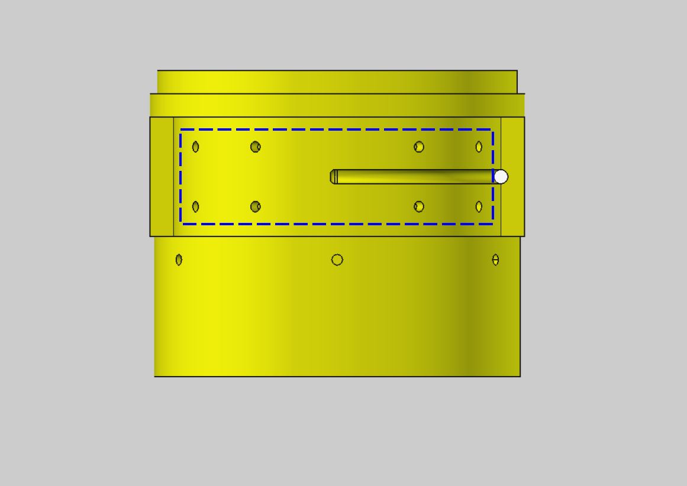

### Step 2 — Bond the front couplers to the front nose cones

Prepare the 2-part Bond epoxy adhesive in small batches. Apply the adhesive all around the **shorter lip** of the front coupler as shown. Align the groove on the coupler with the tab on the nose cone and join them together. Repeat for the second set.

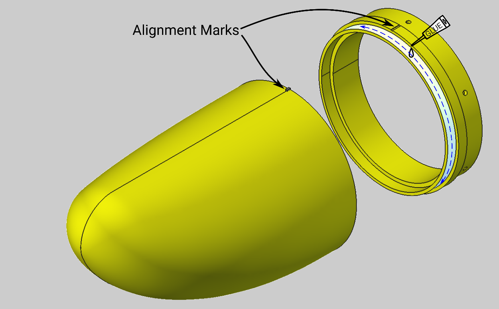

### Step 3 — Bond the rear couplers to the rear nose cones

Repeat the same process to join each rear nose cone to its rear coupler.

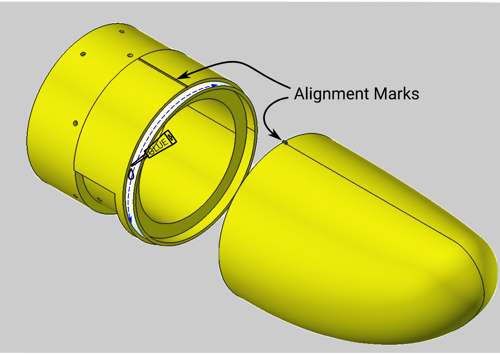

### Step 4 — Fit the front vertical bracket to the PVC pipe

On the **front** end of the pipe, position the vertical bracket **73 mm** from the edge. PVC pipes generally have a vertical printed line along the body — use this line to align with bracket screw hole 1 as shown.

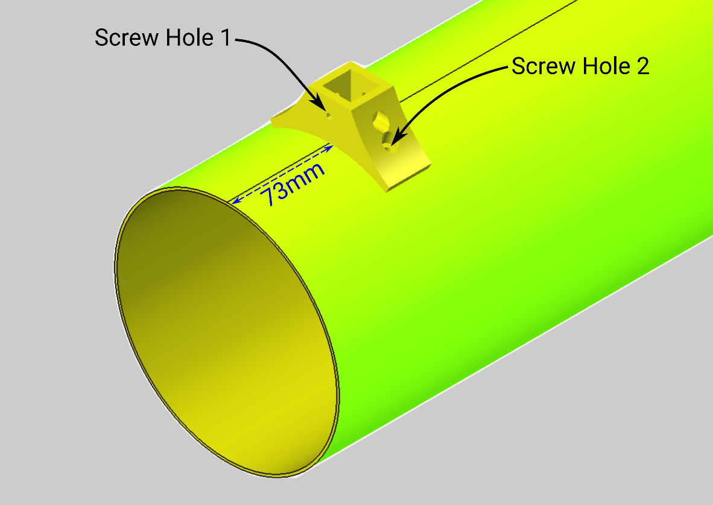

Holding the bracket in the aligned position, drill 4 mm holes through screw hole 2 and its counterpart on the other side of the bracket. Fasten the bracket to the pipe with 2 × M4×16 screws and M4 nuts. Optionally apply epoxy adhesive between the pipe and the bracket underside for a more robust, waterproof fixture.

### Step 5 — Fit the rear vertical bracket

Repeat the process on the other end of the pipe, but position the bracket **29 mm** from the edge. Repeat Steps 4–5 on the second hull.

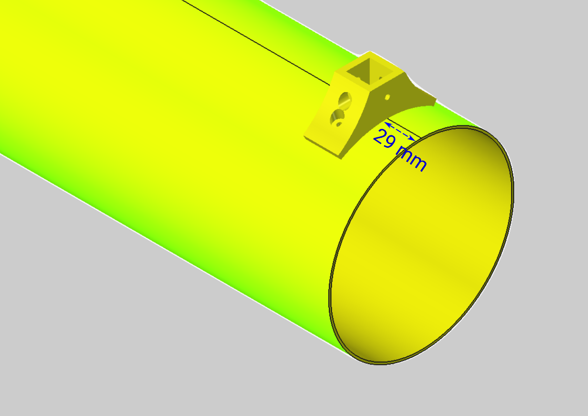

### Step 6 — Bond the front nose-coupler assembly to the pipe

Coat epoxy adhesive on the **longer lip** of the front coupler as shown. Use the groove on the coupler and the printed line on the pipe to align.

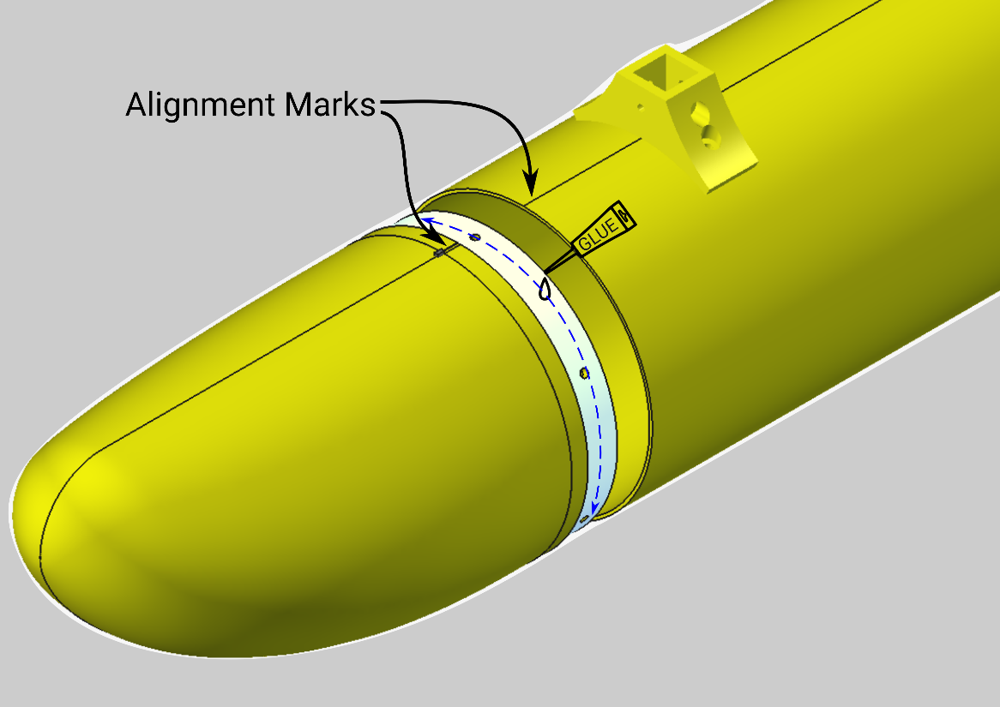

### Step 7 — Bond the rear nose-coupler assembly to the pipe

Repeat for the rear coupler, then repeat both steps on the second hull.

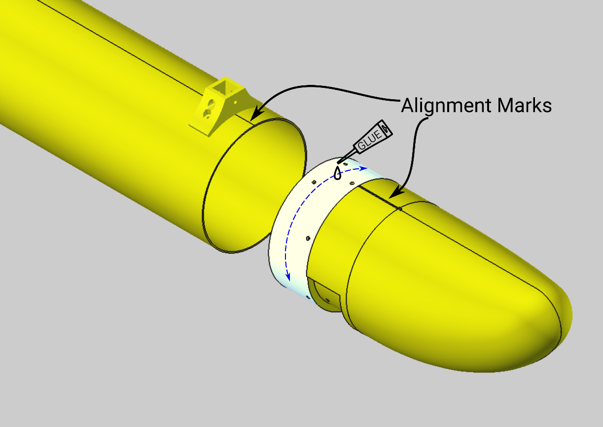

After this step you should have two complete hulls:

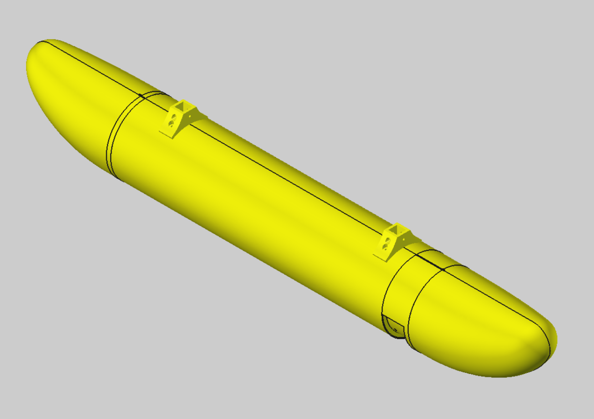

### Step 8 — Seal, sand and paint the hulls

Coat the 3D-printed parts with a thin layer of **epoxy resin** (casting resin, not adhesive). Once dry, lightly sand the entire hulls with 200 grit sandpaper and spray paint in the colour of your choice.

> **Important:** mask the heat insert holes during both the epoxy coating and spray painting operations.

### Step 9 — Assemble the top half of the extrusion brace

Assemble the top half of the aluminium extrusion brace that connects the two hulls, as shown below. The box spacing depends on your electronics enclosure size and can be adjusted to suit your needs. Fasten the T-brackets to the extrusions using M4×10 screws and M4 hammer T-nuts.

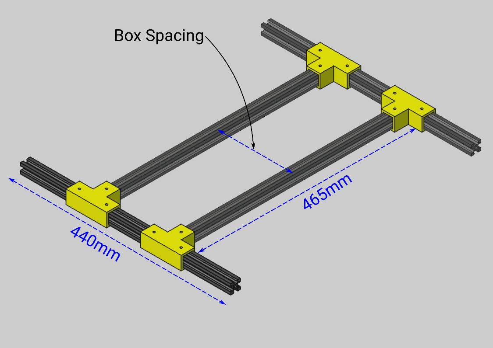

### Step 10 — Assemble the 45° arms

Assemble the 45° arms using the 100 mm extrusions and 45° brackets.

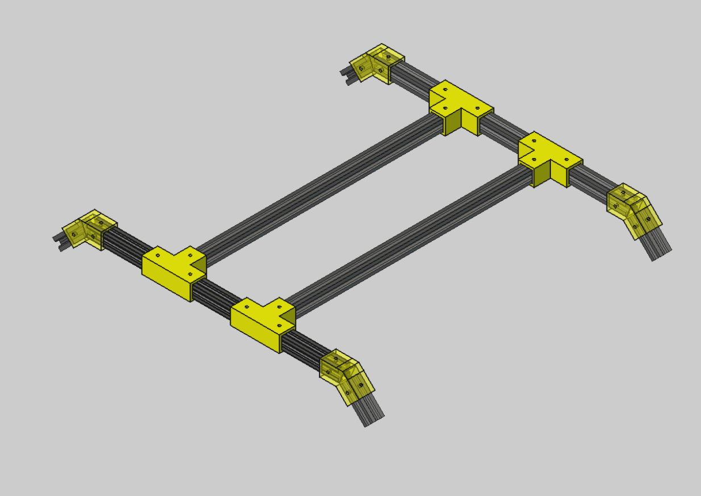

### Step 11 — Assemble the vertical section

Assemble the vertical section; the completed brace should look as shown below. Place the brace on a flat surface and adjust the vertical and 45° arm lengths so that the frame sits level.

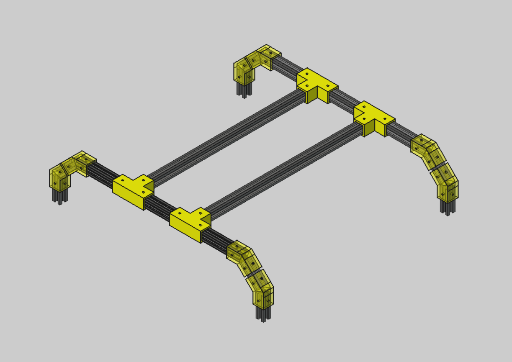

### Step 12 — Join the brace to the hulls

Join the completed brace to the two hulls as shown.

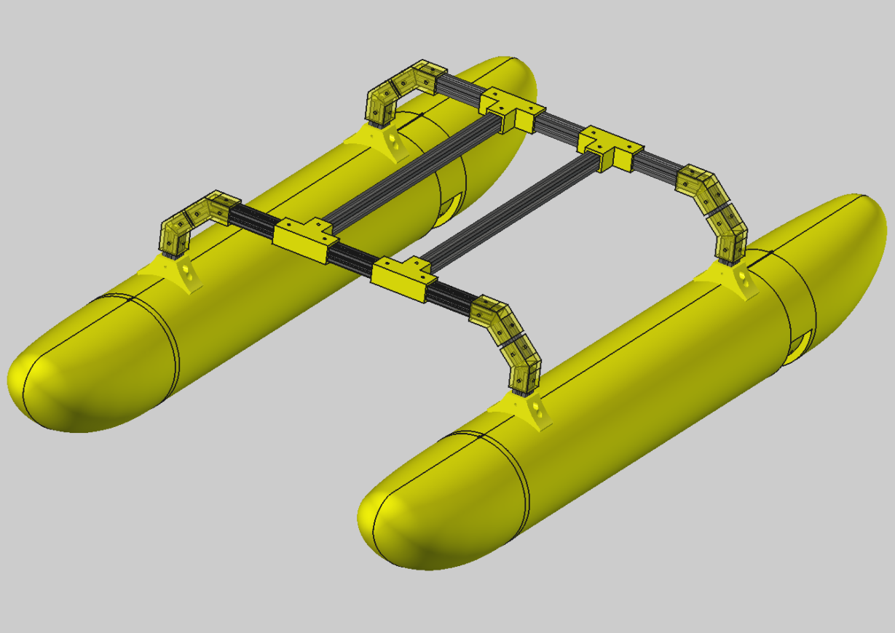

### Step 13 — Assemble and mount the thrusters

Assemble the thrusters as per the instructions in the OpenThruster paper. Route the motor cables through the cable guide as shown; use adhesive tape to hold the cables in place if required. Affix each assembled thruster to the rear coupler using M3×12 screws.

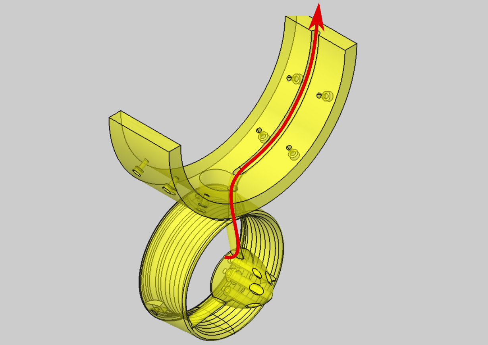

---

