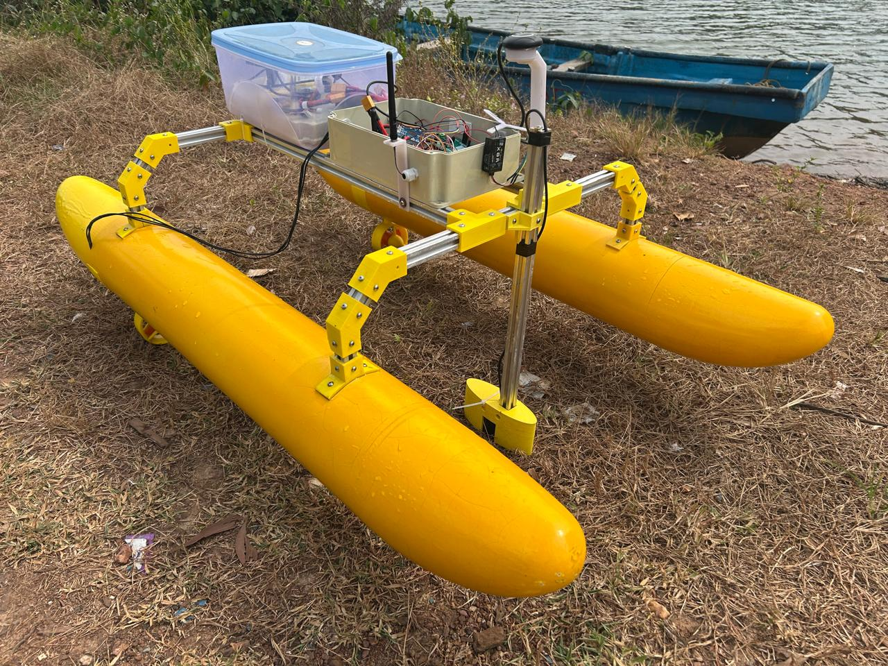

# OpenASV 160 — Design Versions

OpenASV 160 is an open-source, twin-hull autonomous surface vehicle (ASV). This page is a visual index of the design variants in this repository — each section pairs a rendered CAD assembly with a note on what makes that version distinct and links to the folder holding its source files.

## Default Model (High Rider)

📁 [`Final_Assembly_160_High_Rider`](Final_Assembly_160_High_Rider/)

Default model. Higher center of gravity of electronics enclosure to prevent wave water splashing. Fixed differential thrust.

### Exploded View

Exploded view of the default assembly.

Fabricated default version.

## High Rider — Hull Box

📁 [`Final_Assembly_160_High_Rider_HullBox`](Final_Assembly_160_High_Rider_HullBox/)

Version with storage box in the PVC pipe hulls.

## Low Rider

📁 [`Final_Assembly_160_Low_Rider`](Final_Assembly_160_Low_Rider/)

Version with lower center of gravity of electronics enclosure.

## Aero Drive

📁 [`Final_Assembly_160_High_Rider_Aero`](Final_Assembly_160_High_Rider_Aero/)

Version with differential air propeller drive for shallow waters.

## Over-Actuated (Mid-Mount Thrusters)

📁 [`Final_Assembly_160_Low_Rider_3_4DoF`](Final_Assembly_160_Low_Rider_3_4DoF/)

Overactuated version with mid-hull mounted thrusters, pivotable with servos.

---

**Note:** The [`Pipe_Brackets_v2`](Pipe_Brackets_v2/) folder contains updated hull brackets for aluminium extrusions.
