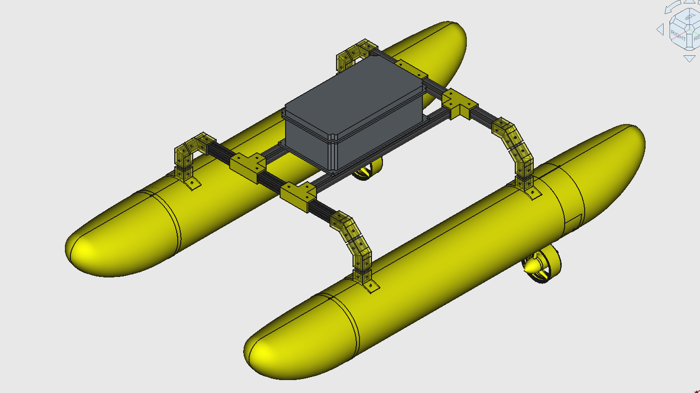
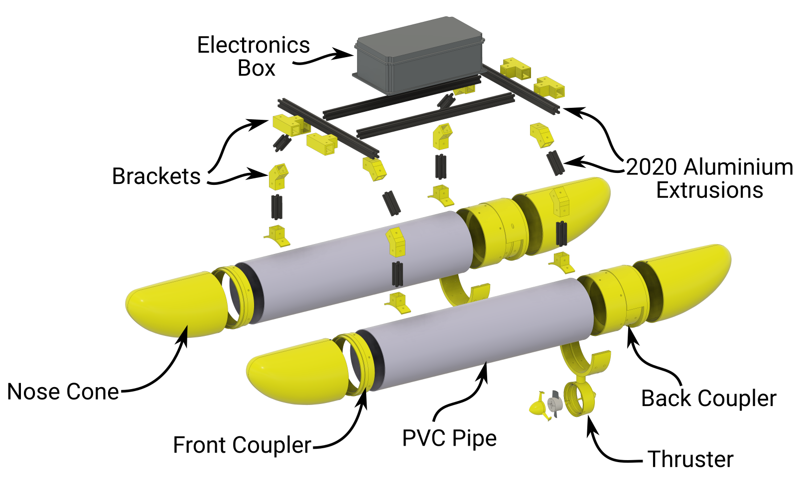
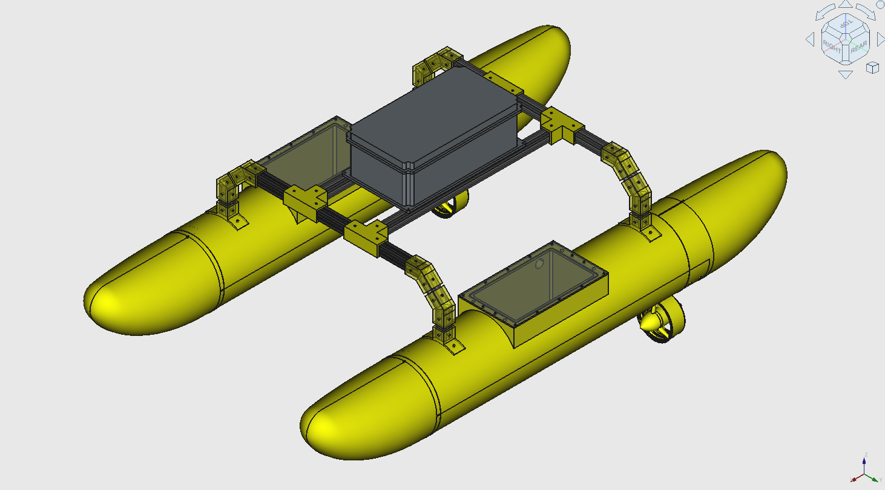
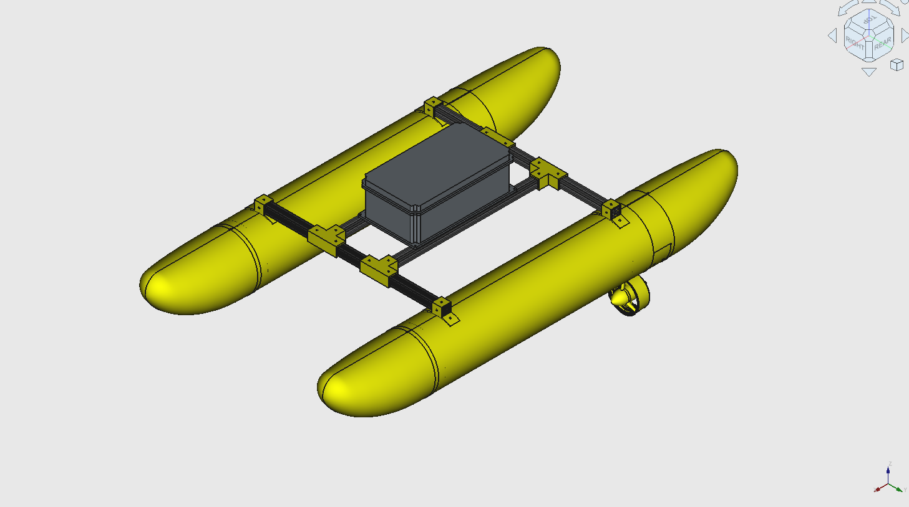
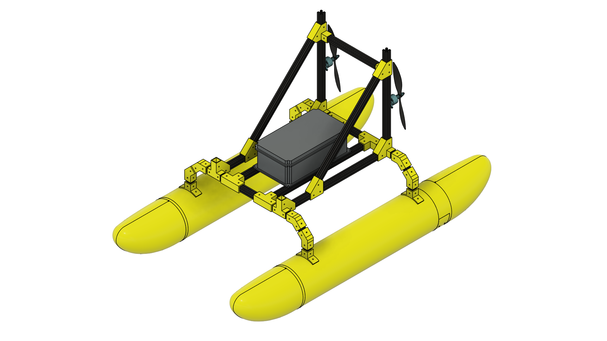
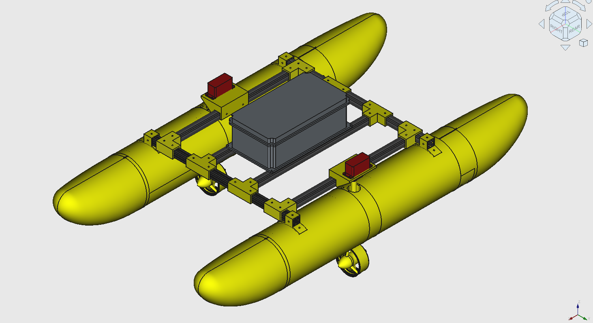

# ASV 160 — Design Versions

This document showcases the different versions of the ASV (Autonomous Surface Vehicle) 160 design. Each image corresponds to a CAD assembly in the repository.

## Default Model (High Rider)

Default model. Higher center of gravity of electronics enclosure to prevent wave water splashing. Fixed differential thrust.

### Exploded View

Exploded view of the default assembly.

## High Rider — Hull Box

Version with storage box in the PVC pipe hulls.

## Low Rider

Version with lower center of gravity of electronics enclosure.

## Aero Drive

Version with differential air propeller drive for shallow waters.

## Over-Actuated (Mid-Mount Thrusters)

Overactuated version with mid-hull mounted thrusters, pivotable with servos.

---

**Note:** The `Pipe_Brackets_v2` folder contains updated hull brackets for aluminium extrusions.
